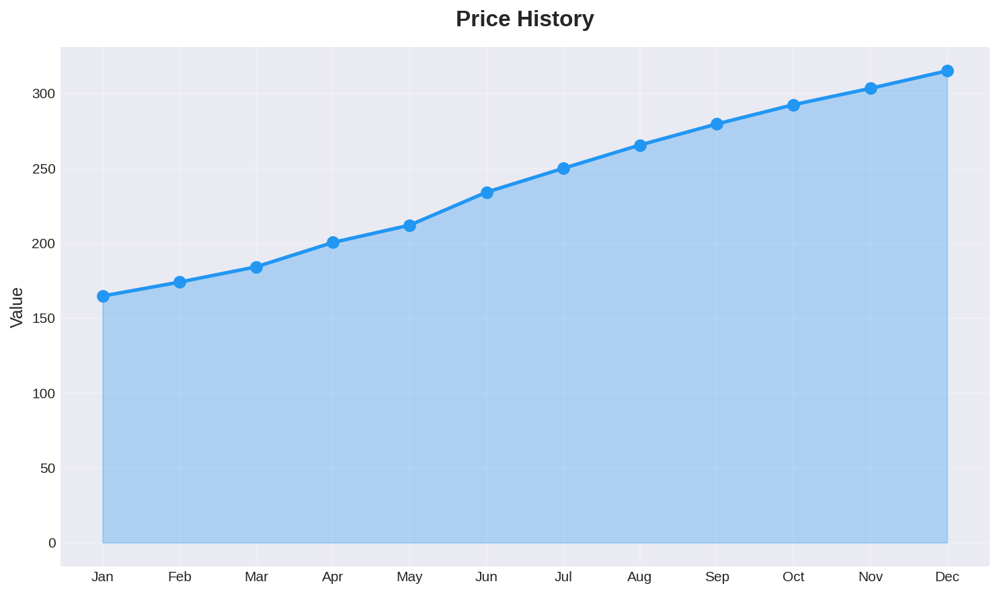
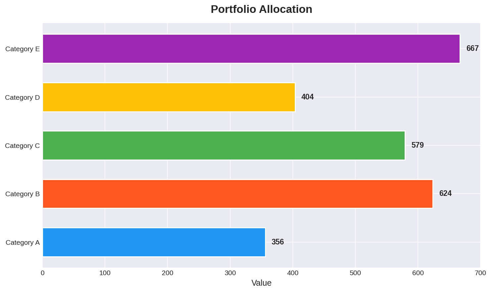
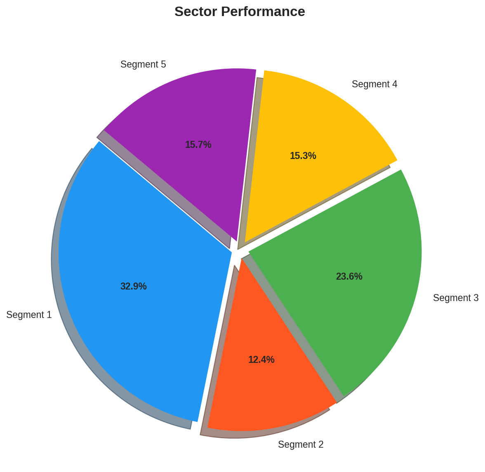
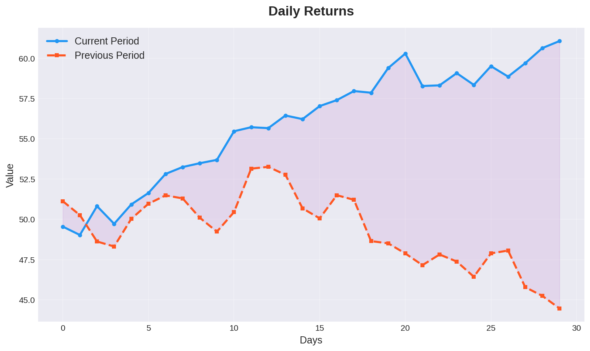

# Stock Market Dashboard

A production-ready Python dashboard project for stock market analysis.

### Features

* Price history page with interactive chart
* Portfolio allocation page with pie chart
* Sector performance page with bar chart

### Screenshots

### Requirements

* Streamlit
* Pandas
* Plotly
* Matplotlib
* NumPy

### Installation

1. Clone the repository
2. Install the dependencies with `pip install -r requirements.txt`
3. Run the dashboard with `streamlit run app.py`

### Testing

Run the unit tests with `python -m unittest tests/test_data.py`